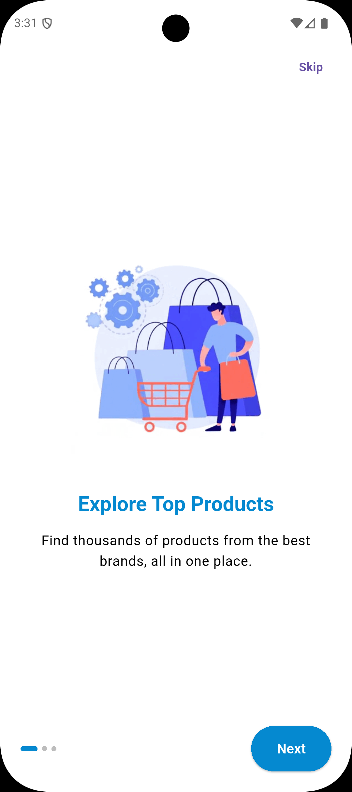
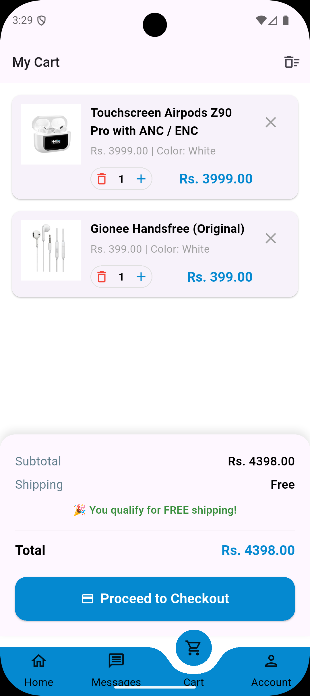

# CyberCart

CyberCart is a feature-rich e-commerce application designed to provide a seamless shopping experience. Built with Flutter, it offers a modern and intuitive user interface for browsing products, managing carts, and processing orders.

## 🚀 Features

-   **User Authentication**: Secure Login, Signup, and Forgot Password functionality.
-   **Product Discovery**: Browse "New Arrivals", "Viral Products", and shop by Categories.
-   **Search**: Efficient product search with an animated search bar.
-   **Product Details**: Comprehensive product views with images, descriptions, and pricing.
-   **Shopping Cart**: Easy-to-use cart management with item summaries.
-   **Checkout Process**: Streamlined checkout flow including address selection.
-   **Order Management**: View "My Orders" and "Track Order" status.
-   **Wishlist**: Save favorite items for later.
-   **Profile Management**: Manage personal details and saved addresses.
-   **Onboarding**: Engaging onboarding screens for new users.

## 🛠️ Tech Stack

-   **Framework**: [Flutter](https://flutter.dev/)
-   **Language**: Dart
-   **State Management**: [Provider](https://pub.dev/packages/provider)
-   **Networking**: [http](https://pub.dev/packages/http)
-   **Local Storage**: [shared_preferences](https://pub.dev/packages/shared_preferences)
-   **UI Components**:
    -   `curved_navigation_bar`
    -   `animated_search_bar`
    -   `flutter_spinkit`
    -   `pin_code_fields`
    -   `font_awesome_flutter`

## 📸 Screenshots

| Onboarding | Login | Home Screen |
| :---: | :---: | :---: |
|  |  |  |

| Product Detail | Cart | Profile |
| :---: | :---: | :---: |
|  |  |  |

## 🏁 Getting Started

### Prerequisites

-   [Flutter SDK](https://flutter.dev/docs/get-started/install) installed.
-   An IDE (VS Code, Android Studio, etc.) with Flutter extensions.

### Installation

1.  **Clone the repository:**

    ```bash
    git clone https://github.com/itzsaad09/CyberCart-Tech-Store-Project-Flutter.git
    cd cybercart
    ```

2.  **Install dependencies:**

    ```bash
    flutter pub get
    ```

3.  **Run the app:**

    ```bash
    flutter run
    ```
